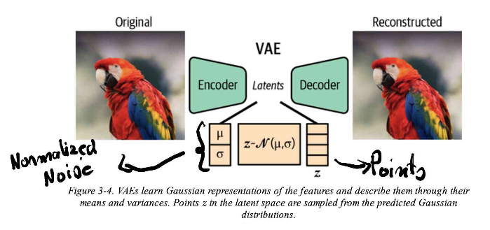
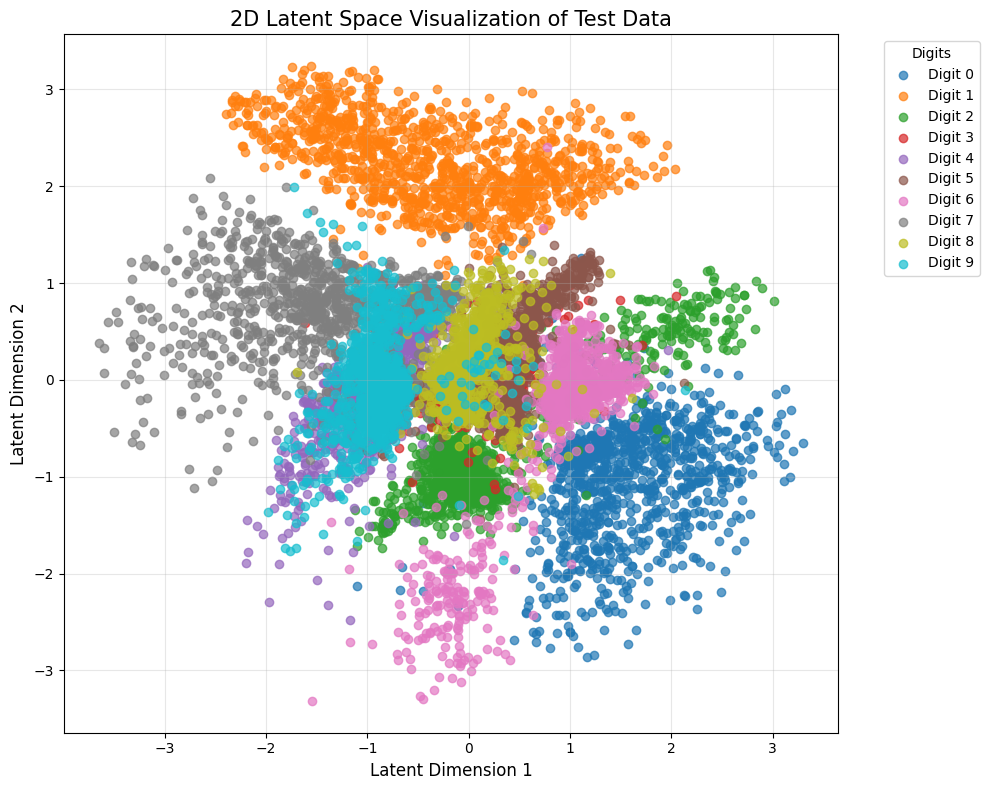
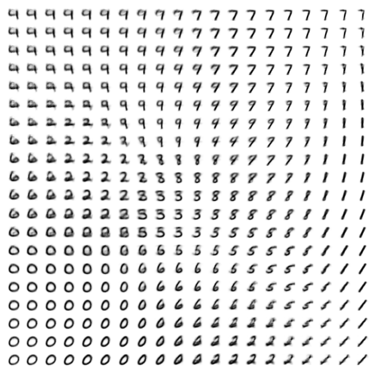

# Variational Autoencoders (VAE)

This module contains implementations of Variational Autoencoders (VAE) in both PyTorch and tinygrad.

## Implementations

This repository contains two implementations of VAEs:

1. **PyTorch Implementation** (`vae_train.py`): A standard VAE implemented using PyTorch.
2. **tinygrad Implementation** (`tiny_vea.train.py`): The same VAE architecture implemented using tinygrad.

Both implementations were developed while reading [Omar Sanseviero's "Hands-On Generative AI with Transformers and Diffusion Models" (2024, O'Reilly Media)](https://www.oreilly.com/library/view/hands-on-generative-ai/9781098149239/).

## Training Results

You can view the training results and compare both implementations on [Weights & Biases](https://wandb.ai/afterhoursbilly/HandsOnGENAI%20-%20VAE).

The training metrics tracked include:
- Total loss
- Reconstruction loss (img_loss)
- KL divergence loss (kl_loss)

## Notebooks

Interactive notebooks demonstrating the VAE implementations can be found in the `nbs/` directory. These notebooks were created while studying the concepts presented in Omar Sanseviero's book and provide step-by-step explanations of the VAE architecture and training process.

