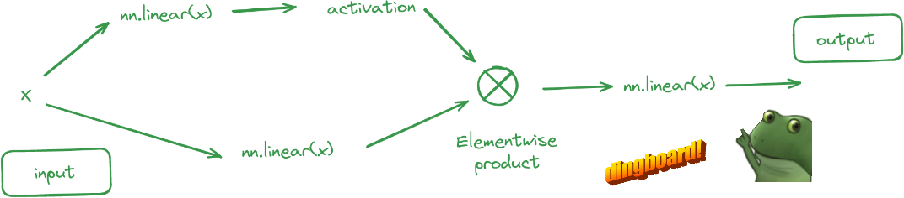

# Feedforward Neural Network (FFN)

GLU - > https://arxiv.org/abs/2002.05202v1

- [wandb](https://wandb.ai/afterhoursbilly/Attention-from-scratch) training log

### Explanations from paper

⊗ - element-wise matrix multiplication - multiplying two matrices of the same size. You can use `*` or `torch.mul`.
V - just another linear layer.
