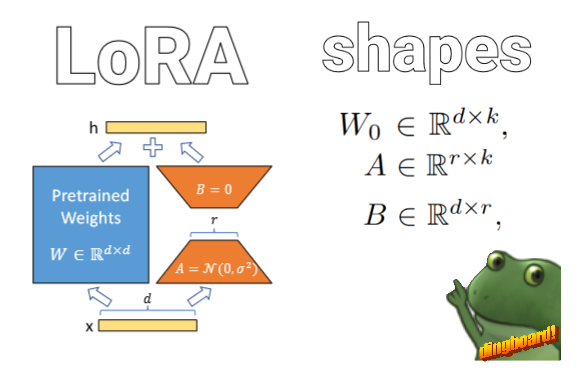

# lora & lora+

## [LORA](https://arxiv.org/abs/2106.09685)
[code](./LoRA.py)

[LORA](https://wandb.ai/afterhoursbilly/lora/runs/) fine-training log \

#### evals 
>Coming soon.

### Confusions about LoRA paper
> Heads up, I only trained GPT2-medium for implementation. 

- I had a lot of confusion about the shapes of the A & B Matrix. 
- I was also shocked to see that GPT2-medium didn't use `q,k,v` for the attention mechanism, but instead used Conv1D, which was a bit confusing to me at first. 
- $(W_{o}x + BAx)$. Is not `linear(x) + B@A@x` but `linear(linear.weight + B@A)` , Which confused me for about 3 days. (I skip scale and bias here for simplicity.)

## [LoRA+](https://arxiv.org/abs/2402.12354)

The paper has a lot of math that can be skipped. The whole idea is that we scale the learning rate differently for the A and B matrices.\
The paper proposes the scale to be $(\eta_{b} \div \eta_{a})=  2^4 $.
It results in 2x faster convergence and sometimes in extra performance.

### Coming later, maybe...
QLORA - https://arxiv.org/abs/2305.14314e
