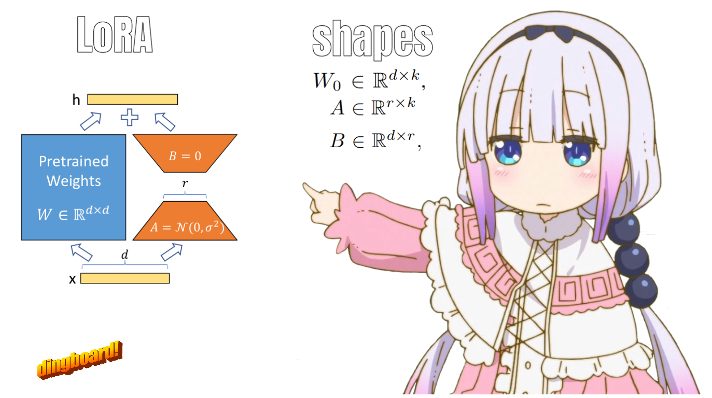

# lora  

[LORA](https://arxiv.org/abs/2106.09685) paper, code(./LoRA.py)

[LORA](https://wandb.ai/afterhoursbilly/lora/runs/) fine-training log

#### evals 
>Coming soon.

### Confusions about LoRA paper
> Heads up, I only trained GPT2-medium for implementation.

- I had a lot of confusion about the shapes of the A & B Matrix.
- I was also shocked to see that GPT2-medium didn't use `q,k,v` for the attention mechanism, but instead used Conv1D, which was a bit confusing to me at first.
- $ W_{o} x + BA_{x} $ Is not `linear(x) + B@A@x` but `linear(linear.weight + B@A)` , Which confused me for about 3 days. (I skip scale and bias here for simplicity.)

### Coming later, maybe...
QLORA - https://arxiv.org/abs/2305.14314e
LORA+ - https://arxiv.org/abs/2402.12354
